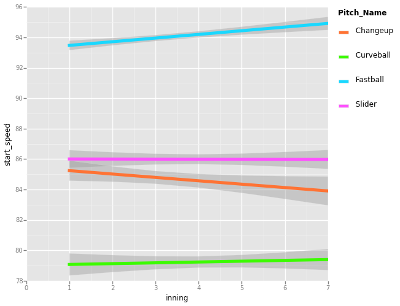
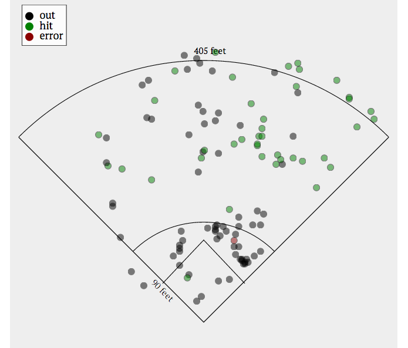

## Python

In the notebook I looked at pitch distributions at home plate, compared the pitches styles of Justin Verlander vs Yu Darvish and more. Notably I discovered the Eephus pitch!

<iframe width="854" height="510" src="https://www.youtube.com/embed/VfWXADedncM" frameborder="0" allowfullscreen></iframe>

One of the many interesting finds was that Verlander's fastball gradually becomes faster over the course of the game.

Matplotlib by itself can be a bit of a hassle to start out with. Luckily there's a wonderful [ggplot](http://ggplot.yhathq.com/) library for Python.

The entire notebook can be viewed [here](http://nbviewer.ipython.org/github/domluna/pitches-and-pitchers/blob/master/Pitches%20and%20Pitchers.ipynb).

## D3.js

I was curious about hit distributions over the field. Teams defense now regularly employ defensive shifts vs. certain hitters.

A shift is when the defense shifts more heavily to one side of the field.

Now, clearly this leaves huge defensive gap in a section of the field, right field in the case of the image above. However if you have prior knowledge that a hitter's hits heavily favour one side the tradeoff can be well worth it.

I had not used D3.js prior to this, so I figured why not?

I made an interactive visualization tool over a very generic baseball field that let's you query via pitchers and hitters.

David Ortiz is known favour right field.

As we can see most hits are towards center and right field! You might be worried about the center but even in a shift center field is quite well covered.

You can play around with the project [here](http://rocky-tor-8041.herokuapp.com/).
