All the code can be found at [this repo](https://github.com/domluna/MetaLearning).

Transfer Learning is when the parameters of a neural network model previously trained on a task are used as
as the starting parameters to train on a new task. The canonical use case being using a convolutional network
trained on [ImageNet](http://www.image-net.org/) to classify images and finetuning the final layer, or the entire model
to classify new image categories, perform image segmentation, detect objects, etc. Very recently natural language has had
its transfer learning epiphany with [BERT](https://github.com/google-research/bert), a pretrained model for language representations.
A key difference between BERT and the ImageNet example is BERT is trained with the goal of "language understanding" whereas training
a convolutional network on ImageNet stumbles upon a useful image representation since the goal is to classify images not "image understanding". Fundamentally, the goal of transfer learning is to learn a function which takes an input and outputs an useful embedding as an input for other functions.

## Meta-Learning

> Meta-Learning learns a function that learns functions.

A neural network to trained to perform image classification learns a function which receives an image as input and outputs a label. While this is a valuable function, it's heavily conditioned on images seen during training and typically fails to generalize to images of unseen classes.  The meta-learning approach would be to train a neural network which is good at *learning to classify images.* 

Could the original classification neural network learn to classify new images?  Absolutely, but its not exactly that simple. How much data of the new class is required? How much longer must the network be trained? Will learning the new class hurt the overall classification performance?

The hope of meta-learning is to learn a new task with minimal additional data and training time. Revising the original description:

> Meta-Learning learns a function that learns functions quickly with minimal data.

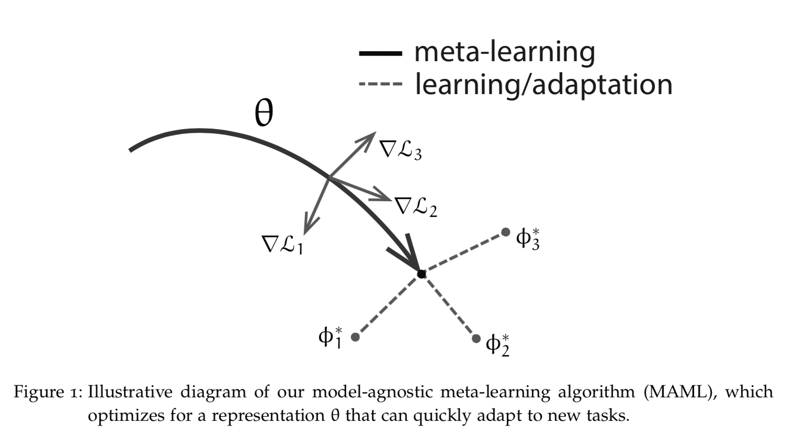

The above figure of MAML is from Chelsea B. Finn's [*Learning to Learn with Gradients*](http://people.eecs.berkeley.edu/~cbfinn/_files/dissertation.pdf). [Reptile](https://blog.openai.com/reptile/) is the other algorithm we'll cover.

There are many possible representations a neural network can learn but there are few representations, $\theta^{*}$ which minimize the average distance and additional training time taken to a optimal solution for any task $t_{i}$. This is representation we attempt to find with meta-learning.

MAML and Reptile consist of two objectives. The first minimizes the loss for a specific task and in doing so leends to teaching the parameters to learn quickly. The second uses information provided from the task specific objective to generalize to new tasks. Formal arguments for this can be found section 5 of the [Reptile paper](https://arxiv.org/abs/1803.02999). This process is repeated until the neural network is good at learning to learn:

```julia
while true
    task = sample_task()
    info = optimize_for_task(task_loss, model_parameters, task)
    grads = optimize_for_meta_goal(meta_loss, model_parameters, task, info)
    model_parameters = update_parameters(model_parameters, grads)
end
```

Before we get into MAML and Reptile implementations let's go over the problem we're solving.

## Problem Setup

We'll be using meta-learning to learn to learn sine waves!

This is a sine wave:

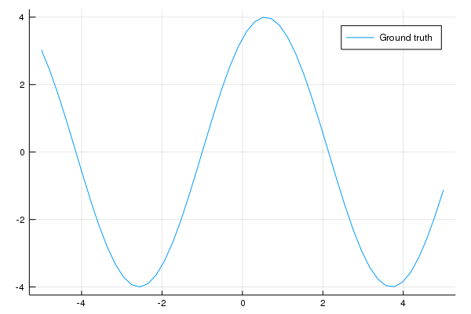

This is what we'd like the neural network to do, given a handful of points figure out the underlying sine wave the points originate from.

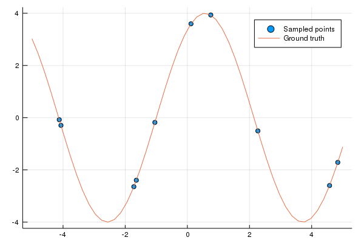

The sine waves will have the following form:

```julia
struct SineWave
    amplitude::Float32
    phase_shift::Float32
end
SineWave() = SineWave(rand(Uniform(0.1, 5)), rand(Uniform(0, 2pi)))

(s::SineWave)(x::AbstractArray) = s.amplitude .* sin.(x .+ s.phase_shift)

function Base.show(io::IO, s::SineWave)
    print(io, "SineWave(amplitude = ", s.amplitude, ", phase shift = ", s.phase_shift, ")")
end
```

where the amplitude shortens or lengthens the height of the wave and phase shift shifts the wave to the left or right. 

If you're new to Julia don't fret, I'm a reasonably good Julia-Python translator :) 

* `struct` is analogous to Python's `class`. 
* `SineWave() = SineWave(rand(Uniform(0.1, 5)), rand(Uniform(0, 2pi)))` is a convenience constructor. Everytime `SineWave()` is called
it will create a `SineWave` with an amplitude and phase shift sampled uniform distributions [0.1, 5] and [0, 2$\pi$] respectively.
* `(s::SineWave)(x::AbstractArray) = s.amplitude .* sin.(x .+ s.phase_shift)`. `(s::SineWave)(x::AbstractArray)` roughly translates to
this method of a `SineWave` class - `def __call__(self, x): ...` where x is a [PyTorch Tensor](https://pytorch.org/docs/stable/tensors.html)
* `s.amplitude .* sin.(x .+ s.phase_shift)`. You may be wondering why there's a `.` before function calls. This signifies the function is applied
elementwise.
* `Base.show` is similar to `def __repr(self, ...)`. It returns a string representation.

Example usage:

```julia
using Distributions

# sample 10 points from a uniform distribution [-5, 5]
julia> x = rand(Uniform(-5, 5), 10)
10-element Array{Float64,1}:
 -1.9279845796432626
 -2.565858434186461
 -0.8290583563692184
  0.32121125997540645
 -2.362361975212195
  2.9885150288281004
  4.728599209179194
  2.174174776306687
 -0.3368270599587264
  4.444254583770027

julia> wave = SineWave(4, 1)
SineWave(amplitude = 4.0, phase shift = 1.0)

julia> wave(x)
10-element Array{Float64,1}:
 -3.201653707457795
 -3.999951234532262
  0.6804413741673037
  3.8760599776431177
 -3.9134243632070027
 -2.9969826795933403
 -2.1063659183401633
 -0.1303054327518841
  2.462481437847728
 -2.9757159681499266
```

Unless otherwise stated the following model will be used:

```julia
using Flux
using MetaLearning

model = Chain(
   Linear(1, 64, tanh), 
   Linear(64, 64, tanh), 
   Linear(64, 1)
)

```

`Linear` is a slight modification of [`Dense`](https://github.com/FluxML/Flux.jl/blob/3d41dca33871ee1a25e443bfe47d2e5f291091b9/src/layers/basic.jl#L65-L89). The modification is uses both the input and output
dimension values to calculate bias initialization. All weights and biases are initialized with a uniform distribution
initialization $[-\sigma, \sigma]$ with $\sigma$ defined as:

$$
\sigma = \sqrt\frac{1}{n_{in}}
$$

where $n_{in}$ is the input dimension. This is known as the [Xavier initialization](http://proceedings.mlr.press/v9/glorot10a/glorot10a.pdf) and it performed better than `glorot_uniform` initialization baked into Flux's `Dense` layer.

The above Flux architecture maps to the following in PyTorch:

```python
import torch.nn as nn

model = nn.Sequential(
    nn.Linear(1, 64),
    nn.Tanh(),
    nn.Linear(64, 64),
    nn.Tanh(),
    nn.Linear(64, 1),
)
```

The following code evaluates the `model` on a sine wave `task` training to sample `x` with `updates`
amount of gradient steps using `opt`. Unless otherwise stated finetuning involes 32 gradient update steps. 

Evaluation loss is calculated based on the mean squared error
between model predictions and sine wave values: `Flux.mse(model(testx'), testy')`.

```julia
function eval_model(model, x::AbstractArray, testx::AbstractArray, task=SineWave(); 
                    opt=Descent(1e-2), updates=32)
    weights = params(model)
    prev_weights = deepcopy(Flux.data.(weights))

    y = task(x)
    testy = task(testx)
    init_preds = model(testx')
    test_loss = Flux.mse(init_preds, testy')

    test_losses = Float32[]
    push!(test_losses, Flux.data(test_loss))

    @printf(task)
    @printf("Before finetuning, Loss = %f\n", test_loss)
    for i in 1:updates
        l = Flux.mse(model(x'), y')
        Flux.back!(l)
        Flux.Optimise._update_params!(opt, weights)
        test_loss = Flux.mse(model(testx'), testy')
        push!(test_losses, Flux.data(test_loss))
        @printf("After %d fits, Loss = %f\n", i, test_loss)
    end
    final_preds = model(testx')

    Flux.loadparams!(model, prev_weights)

    return (x=x, testx=testx, y=y, testy=testy, 
            initial_predictions=Array(Flux.data(init_preds)'),
            final_predictions=Array(Flux.data(final_preds)'), 
            test_losses=test_losses)
end
```

The returned values are used for plotting with [`Plots`](http://docs.juliaplots.org/latest/):

```julia
using Plots

function plot_eval_data(data::NamedTuple, title="")
    return plot([data.x, data.testx, data.testx, data.testx], 
                [data.y, data.testy, data.initial_predictions, data.final_predictions],
                line=[:scatter :path :path :path],
                label=["Sampled points", "Ground truth", "Before finetune", "After finetune"],
                foreground_color_legend=:white, background_color_legend=:transparent,
                title=title, 
                xlim=(-5.5, 5.5))
end
```

Time for a Flux to PyTorch translation detour!

* `params(model)` -> `model.parameters()`
* `Flux.mse` -> `torch.nn.functional.mse_loss`
* `Flux.back!(l)` -> `l.backward()`
* `Flux.Optimizer._update_params!(opt, weights)` -> `opt.step(); opt.zero_grad()`

## Experiments

### Random Model

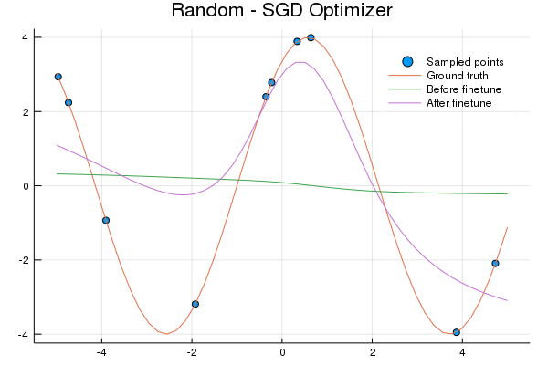 


Here's the code used to generate the plot:

```julia
# These will be used in future model evaluations
x = rand(Uniform(-5, 5, 10)
testx = range(-5; stop=5, length=50)
wave = SineWave(4, 1)

# This model is not trained
random_model = Chain(Linear(1, 64, tanh), Linear(64, 64, tanh), Linear(64, 1))

data = eval_model(random_model, x, testx, wave, updates=32, opt=Descent(0.02))

p = plot_eval_data(data, "Random - SGD Optimizer")
plot(p)
```

### Transfer Learning

This is essentially a standard training procedure:

```julia
function transfer_learn(model; opt=Descent(0.02), epochs=30_000, 
                        train_batch_size=50, eval_batch_size=10, eval_interval=1000)

    weights = params(model)
    dist = Uniform(-5, 5)
    testx = range(-5, stop=5, length=50)

    for i in 1:epochs
        task = SineWave()
        x = rand(dist, train_batch_size)
        y = task(x)
        l = Flux.mse(model(x'), y')
        Flux.back!(l)
        Flux.Optimise._update_params!(opt, weights)

        if i % eval_interval == 0
            @printf("Iteration %d, evaluating model on random task...\n", i)
            eval_x = rand(dist, eval_batch_size)
            eval_model(model, eval_x, testx, SineWave())
        end
    end
end
```

The only difference from the random model code is `transfer_learn` is called after
the model is initialized.

```julia
transfer_model = Chain(Linear(1, 64, tanh), Linear(64, 64, tanh), Linear(64, 1))
transfer_learn(transfer_model, epochs=50_000, opt=Descent(0.01))
...
p = plot_eval_data(data, "Transfer - SGD Optimizer")
```

Transfer learning doesn't fair any better than using a random model:

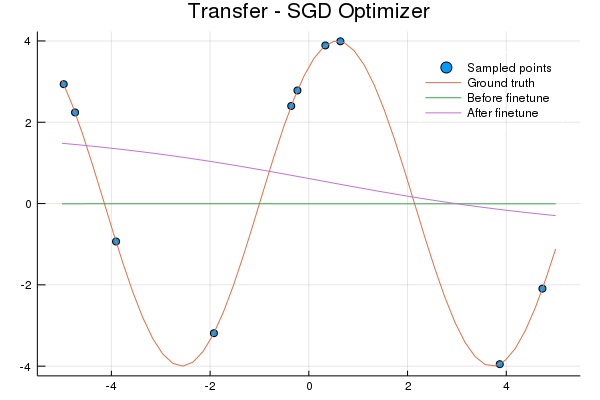 

Why? Let's examine the sine wave dataset. The model is learning to map a number to a number.

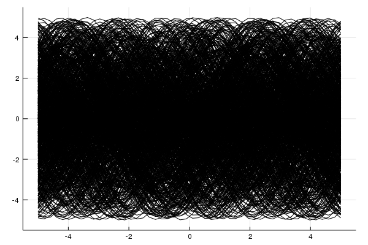 

That's 1000 sine waves. See the problem? For every x (input) value there's a line of possible y (output) values,
thus the model will simply learn to predict 0 - the expected value. Meta-learning models will learn to do the same, the difference being the representation learned is optimized to 
quickly learn a new task whereas the transfer learning representation does not. 

### MAML


*By Mark Basarab on Unsplash*

MAML can be succinctly described as:

$$
\phi_i = \theta - \alpha \bigtriangledown_{\theta} Loss(D_{t_i}^{train}; \theta) \\
\theta \leftarrow \theta - \beta \sum_i \bigtriangledown_{\theta} Loss(D_{t_i}^{test}; \phi_i)
$$

The first line shows the inner update, which optimizes $\theta$ towards a solution for the task training set
$D_{t_i}^{train}$ producing $\phi_i$. The following line is the meta update which aims to generalize to new data. This involves evaluating all $\phi_i$ on the test sets $D_{t_i}^{test}$ and accumulating the resulting gradients. $\alpha$ and $\beta$ are learning rates.

The difference between MAML and FOMAML (first-order MAML) is the inner gradient, shown is red is ignored during backpropagation:

$$
\theta = \theta - \beta \sum_i \bigtriangledown_{\theta} Loss( \theta - \alpha {\color{red} \bigtriangledown_{\theta} Loss(\theta, D_{t_i}^{train})}, D_{t_i}^{test})
$$

We'll focus on FOMAML since it's less computationally expensive and achieves similar performance to MAML in practice and has a simpler implementation.

FOMAML generalizes by further adjusting parameters based on how performance on a validation or test set (used interchangeably) during the meta update. This is best shown visually:

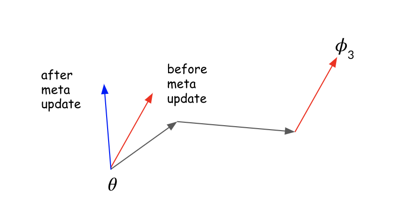

$\theta$ is the starting point, $\phi_{3}$ is the parameter values after 3 gradient updates on a task. Notice before the meta update the parameters shift in the direction of the new task's solution (red arrow) but after the meta update they change direction (blue arrow). This illustrates how the meta update adjusts the gradient for task generalization.

Here's the code:

```julia
function fomaml(model; meta_opt=Descent(0.01), inner_opt=Descent(0.02), epochs=30_000, 
              n_tasks=3, train_batch_size=10, eval_batch_size=10, eval_interval=1000)

    weights = params(model)
    dist = Uniform(-5, 5)
    testx = Float32.(range(-5, stop=5, length=50))

    for i in 1:epochs
        prev_weights = deepcopy(Flux.data.(weights))

        for _ in 1:n_tasks
            task = SineWave()

            x = Float32.(rand(dist, train_batch_size))
            y = task(x)
            grad = Flux.Tracker.gradient(() -> Flux.mse(model(x'), y'), weights)

            for w in weights
                w.data .-= Flux.Optimise.apply!(inner_opt, w.data, grad[w].data)
            end

            testy = task(testx)
            grad = Flux.Tracker.gradient(() -> Flux.mse(model(testx'), testy'), weights)

            # reset weights and accumulate gradients
            for (w1, w2) in zip(weights, prev_weights)
                w1.data .= w2
                w1.grad .+= grad[w1].data
            end

        end

        Flux.Optimise._update_params!(meta_opt, weights)

        if i % eval_interval == 0
            @printf("Iteration %d, evaluating model on random task...\n", i)
            evalx = Float32.(rand(dist, eval_batch_size))
            eval_model(model, evalx, testx, SineWave())
        end

    end
end
```

Let's walk through this:

`grad = Flux.Tracker.gradient(() -> Flux.mse(model(x'), y'), weights)` is equivalent to [`torch.autograd.grad`](https://pytorch.org/docs/stable/autograd.html#torch.autograd.grad) with `create_graph=True`. The gradients returned from `Flux.Tracker.gradient` are `TrackedArray`'s which automatically keep track of operations for differentiation. In order to avoid this we can access the `.data` field which is a `Array` and does not track operations for differentiation.

```julia
for w in weights
	w.data .-= Flux.Optimise.apply!(inner_opt, w.data, grad[w].data)
end
```

`Flux.Optimise.apply!` computes the gradient given the optimizer which is then applied to the weights, `w.data .-= ...`.

`grad = Flux.Tracker.gradient(() -> Flux.mse(model(testx'), testy'), weights)` is the gradient from evaluating $\phi_t$ on the test set.

Next we accumulate the gradients and reset the weights:

```julia
for (w1, w2) in zip(weights, prev_weights)
	w1.data .= w2
	w1.grad .+= grad[w1].data
end
```

Finally we update the original weights $\theta$: `Flux.Optimise._update_params!(meta_opt, weights)`.

Training with FOMAML:

```julia
fomaml_model = Chain(Linear(1, 64, tanh), Linear(64, 64, tanh), Linear(64, 1))
fomaml(fomaml_model, meta_opt=Descent(0.01), inner_opt=Descent(0.02), epochs=50_000, n_tasks=3)
...
p = plot_eval_data(data, "FOMAML - SGD Optimizer")
```

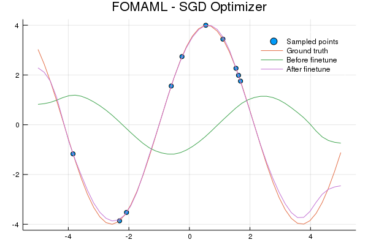

### Reptile


*By Gary Bendig on Unsplash*

Reptile optimizes to find a point (parameter representation) in manifold space which is closest in euclidean distance to
a point in each task's manifold of optimal solutions. To achieve this we minimize the expected value for all tasks $t$
of $(\theta - \phi_{*}^{t})^2$ where $\theta$ is the model's parameters and $\phi_{*}^{t}$ are the optimal parameters 
for task $t$.

$$
E_{t}[\frac{1}{2}(\theta - \phi_{*}^{t})^2]
$$

In each iteration of Reptile we sample a task and update $\theta$ using SGD:

$$
\theta \leftarrow \theta - \alpha \bigtriangledown_{\theta} \frac{1}{2}(\theta - \phi_{*}^{t})^2 \\
\theta \leftarrow \theta - \alpha(\theta - \phi_{*}^{t})
$$

In practice an approximation of $\phi_{*}^{t}$ is used since it's not feasible to compute. The approximation
is $\phi$ after $i$ gradient steps $\phi_{i}^{t}$.

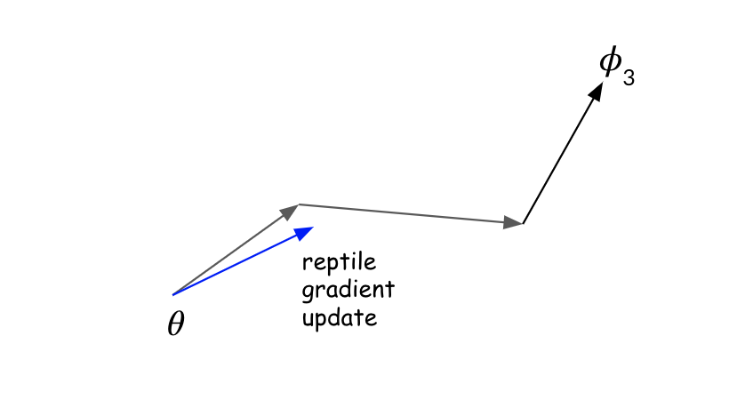

This a Reptile update after training for 3 gradient steps on task data. Note with Reptile there's no train and test data, just data. The direction of the gradient update (blue arrow) is directly in the direction towards $\phi_i$.  It's kind of crazy that this actually works. Section 5 of the [Reptile paper](https://arxiv.org/abs/1803.02999) has an analysis showing the gradients of MAML, FOMMAL and Reptile are similar within constants.

Here's the code for Reptile.


```julia
function reptile(model; meta_opt=Descent(0.1), inner_opt=Descent(0.02), epochs=30_000, 
                 train_batch_size=10, eval_batch_size=10, eval_interval=1000)

    weights = params(model)
    dist = Uniform(-5, 5)
    testx = Float32.(range(-5, stop=5, length=50))
    x = testx

    for i in 1:epochs
        prev_weights = deepcopy(Flux.data.(weights))
        task = SineWave()

        # Train on task for k steps on the dataset
        y = task(x)
        for idx in partition(randperm(length(x)), train_batch_size)
            l = Flux.mse(model(x[idx]'), y[idx]')
            Flux.back!(l)
            Flux.Optimise._update_params!(inner_opt, weights)
        end

        # Reptile update
        for (w1, w2) in zip(weights, prev_weights)
            gw = Flux.Optimise.apply!(meta_opt, w2, w1.data - w2)
            @. w1.data = w2 + gw
        end

        if i % eval_interval == 0
            @printf("Iteration %d, evaluating model on random task...\n", i)
            evalx = Float32.(rand(dist, eval_batch_size))
            eval_model(model, evalx, testx, SineWave())
        end

    end
end
```

The only interesting bit here is the Reptile update:

```julia
for (w1, w2) in zip(weights, prev_weights)
	gw = Flux.Optimise.apply!(meta_opt, w2, w1.data - w2)
	@. w1.data = w2 + gw
end
```

The gradient is `w1.data - w2` which pulls the parameters in the direction of the solution to the task $t_i$.

Training using Reptile:

```julia
reptile_model = Chain(Linear(1, 64, tanh), Linear(64, 64, tanh), Linear(64, 1))
reptile(reptile_model, meta_opt=Descent(0.1), inner_opt=Descent(0.02), epochs=50_000)
...
p = plot_eval_data(data, "Reptile - SGD Optimizer")
```

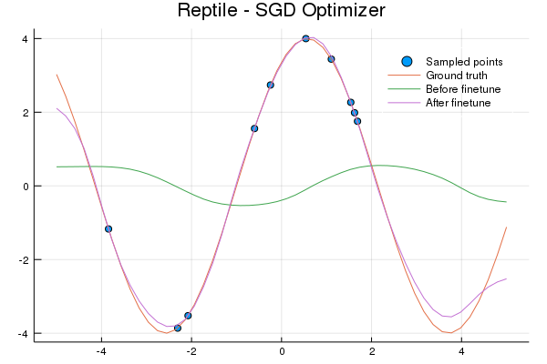 


### Testing Robustness

To test if the FOMAML and Reptile representations *learned to learn quickly with minimal data* we'll finetune on 5 datapoints for 10 update steps. The x values are sampled from a uniform distribution of [0, 5], which is only the right half of the sine wave. Let's see if the entire wave can be learned quickly.

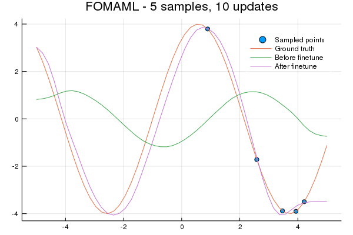

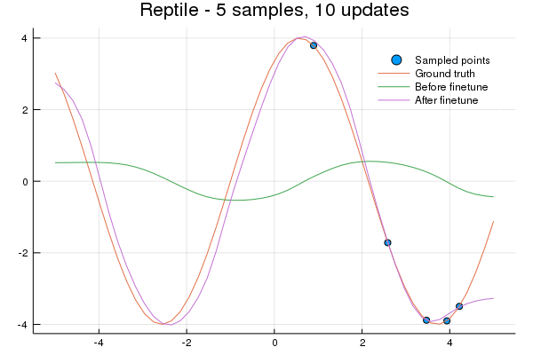

Lastly, let's see how quickly a representation is learned for a new task. We'll use the same 5-element sample as before and train for 10 gradient updates.

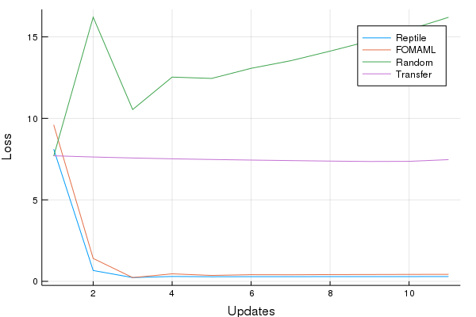

Cool! Both FOMAML and Reptile learn a very useful representation within a few updates. Both the transfer and random models perform poorly, as we would probably expect.

### Notes

* The sine wave problem is susceptible to loss divergence (loss -> inf). The Xavier initialization, especially for the initial layer, `Linear(1, 64)` seems to be particularly important. I tinkered with optimizers a fair amount, I was suprised `ADAM` didn't perform well.
* `Descent(0.02)` performs much better than `Descent(0.01)` as the inner optimizer. I hypothesize this is due to the small amount
of updates in the inner loop thus it's particularly important to learn quickly. 
* `relu` perform worse than `tanh` - the predicted sine wave isn't as smooth.
* Learning the structure of a sine wave internally then scaling and shifting it during finetuning is super awesome.
