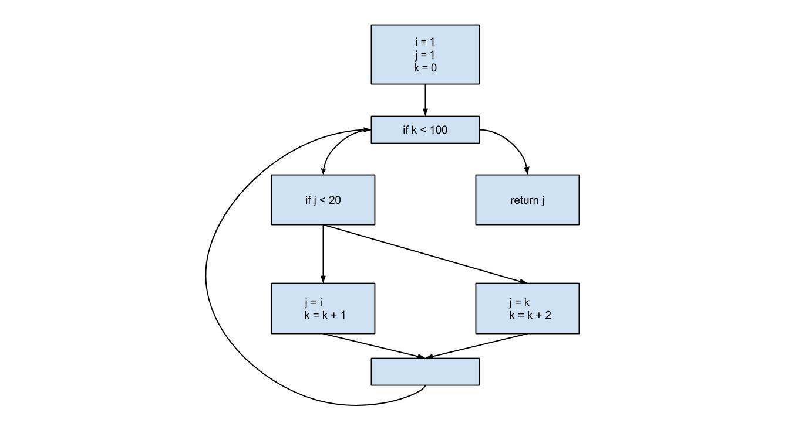
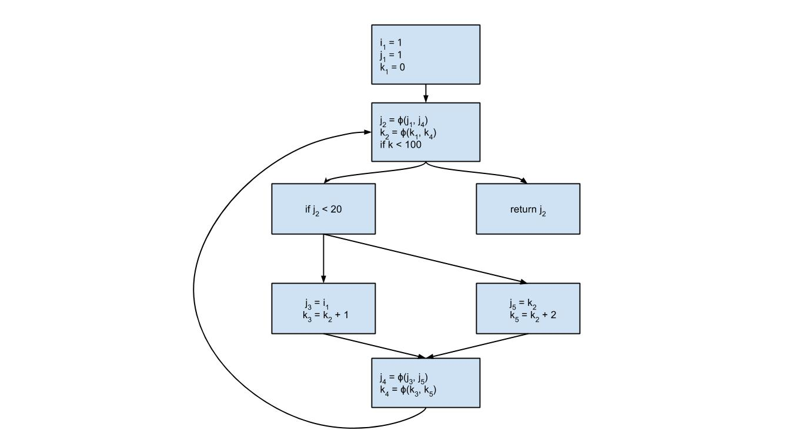

### Variables

The underlying idea behind SSA is variables are assigned **exactly once**. You can think of it kind of like a Social Security Number. The notation generally used here is the variable name with a subscript.

```
y = 1
y = 2
x = y
```

Would be translated to (pretend those are subscripts!):

```
y_1 = 1
y_2 = 2
x_1 = y_2
```

You can think of this as "versions" of the variable, kind of like Git. 

Alright, so variables are assigned exactly once and we maintain this by assigning versions to future uses of the original assignment. That's not so bad, but by itself it doesn't seem all that useful. So why is SSA talk all the rage in compilers?

For that let's take a look at how an actual program is structured.

### Control Flow Graph

Ok let's take a sample program and translate it to a [CFG](https://en.wikipedia.org/wiki/Control_flow_graph).

```
i = 1
j = 1
k = 0
while k < 100
    if j < 20
        j = i
        k = k + 1
    else
        j = k
        k = k + 2
    end
end
return j
```

And now the CFG.



The blocks here are known as [basic blocks](https://en.wikipedia.org/wiki/Basic_block).

Alright now let's SSAify it.



There's a weird symbol some of the blocks. This is called the Φ *"Phi"* function. These appear at the beginning of a block and decide which version of the variable to use in the current block. We only need this function if we're unsure of which variable to use. Notice how we never have a Phi function for *x*, that's because we only ever have the original version in play.

So that's the gist of SSA we have our variables which are assigned to once and only once, and we have our Phi functions which determine what version of the variable to use. It turns out with this representation you can [optimize quite a bit.](https://en.wikipedia.org/wiki/Optimizing_compiler#SSA-based_optimizations)

But a question remains ...

How do we know where to put the Phi functions? This might be obvious in our above example, it's a very small program. In practice our programs are waaaay more complicated and those arrows can get a bit wild.

### Domination!

This is the domain of [Domination Algoritms](https://en.wikipedia.org/wiki/Dominator_(graph_theory\)). It's a nice name, straight to the point. We want to know which nodes are dominated by other nodes. Ok, cool name but what does dominated mean in this context.

> Node B is dominated by node A if all paths from the entry node to B must first go through A. It's impossible to get to B without going through A first.

Wait a sec! What's the entry node! It's the entry level block, a good way to think about it is in terms of functions in your program (not Phi functions). The first part of your function that's the entry node. You have the main function, that calls other functions, which call other functions, etc. Functions all the way down.

So if we reach **B** we know the code in **A** has run. Hmmmm ... this might influence where we place our fancy Phi functions.

The next concept we need is the *dominance frontier*.

> Node B is in the dominance frontier of node A if A does not dominate B but A domiantes a predecessor of B.

So how we know there's another path to **B** that doesn't go through **A**. This is the precise place to put a Phi function!

There's a lot more you can do here than what I've described but that's for another time and place. In general, there are several flavours of SSA, the one I went over here is the most basic.

### What next

If you want to learn more the [SSA Book](http://ssabook.gforge.inria.fr/latest/book.pdf) is the best source of there.

For Go 1.6 there's some exciting SSA things going on on the [dev.ssa branch](https://github.com/golang/go/commits/dev.ssa). The source is very readable, but it's Go so not suprising :)

There's also a nice paper [here](http://dl.acm.org/citation.cfm?id=278285) about the connection between SSA and functional programming. TLDR: SSA *is* functional programming. It's interesting to think about how we use functional programming ideas/optimizations in SSA and vice-versa. Nice, short read with an interesting result.
